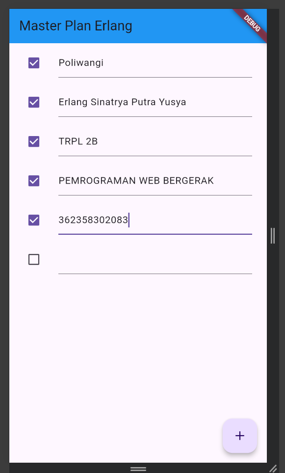

Nama    : Erlang Sinatrya Putra Yusya

NIM     : 362358302083

Kelas   : TRPL 2B

PRAKTIKUM 1 

Tugas 1

no 2. Jelaskan maksud dari Langkah 4 pada praktikum tersebut! Mengapa dilakukan demikian?

Langkah 4 membuat file data_layer.dart yang berfungsi sebagai pengelompokan data. Di dalamnya, ada export dari model task.dart dan plan.dart.
Maksud dari langkah ini adalah untuk mempermudah proses impor model di file lain. Dengan hanya mengimpor data_layer.dart, Anda sudah bisa mengakses semua model yang digunakan di dalam aplikasi, menjadikan struktur kode lebih rapi dan efisien.

no 3. Mengapa perlu variabel plan di Langkah 6? Mengapa dibuat sebagai konstanta?

Variabel plan digunakan sebagai data utama yang menyimpan daftar rencana (tasks) dalam aplikasi. Ini memungkinkan aplikasi untuk melacak dan memperbarui daftar tugas ketika pengguna menambah atau memperbarui tugas.
Variabel plan dibuat sebagai const untuk menginisialisasinya dengan nilai default saat awal. Dengan const, data yang dipegang oleh variabel ini bersifat tetap (immutable) pada awalnya, tetapi akan berubah ketika fungsi setState dijalankan (karena setiap kali diperbarui, plan diinisialisasi ulang dengan salinan data baru). Ini merupakan praktik umum untuk memastikan konsistensi data.

no 4. Capture hasil dari Langkah 9 berupa GIF, lalu jelaskan apa yang telah Anda buat!

Langkah 9 berfokus pada pembuatan widget _buildTaskTile, yang menampilkan daftar tugas menggunakan ListTile.
GIF hasil dari langkah ini harus menunjukkan interaksi pengguna dengan daftar tugas: pengguna bisa mengetik deskripsi tugas dan menandai tugas sebagai selesai (checkbox). Tunjukkan juga bahwa aplikasi memperbarui tampilan secara dinamis saat ada perubahan pada deskripsi atau status selesai.

no 5. Apa kegunaan method pada Langkah 11 dan 13 dalam lifecycle state?

Langkah 11 menambahkan ScrollController dan Scroll Listener pada aplikasi. Ini memungkinkan aplikasi untuk menghapus fokus dari TextField saat pengguna menggulir layar. Tanpa ini, TextField di bagian bawah layar bisa tertutup oleh keyboard saat aktif, terutama pada perangkat iOS.
Langkah 13 menambahkan method dispose() yang membersihkan scrollController saat widget tidak lagi digunakan. Ini penting untuk mengelola memori secara efisien dan mencegah kebocoran memori dengan memastikan bahwa semua listener dihapus saat widget dihancurkan.